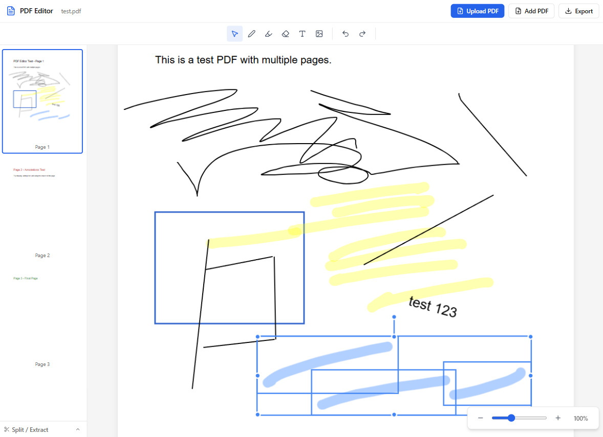

# Simple PDF Editor / PDFエディター

## instantly use it ---> [here こちら](https://phuahjinwei.github.io/BlackJack-Mobile/)


---

## Getting Started

First, download ZIP, extract and run the development server:

```bash
npm run dev
# or
yarn dev
# or
pnpm dev
# or
bun dev
```

Open [http://localhost:3000](http://localhost:3000) with your browser to see the result.

You can start editing the page by uploading or opening any PDF documents.
